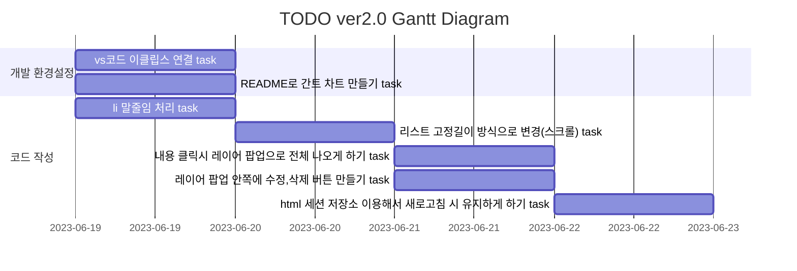

```mermaid
gantt
    title TODO ver2.0 Gantt Diagram
    dateFormat  YYYY-MM-DD
    section 개발 환경설정
    vs코드 이클립스 연결 task           :2023-06-19, 1d
    README로 간트 차트 만들기 task     :2023-06-19, 1d
    section 코드 작성
    li 말줄임 처리 task      : 2023-06-19, 1d
    리스트 고정길이 방식으로 변경(스크롤) task      : 2023-06-20, 1d
    내용 클릭시 레이어 팝업으로 전체 나오게 하기 task      : 2023-06-21, 1d
    레이어 팝업 안쪽에 수정,삭제 버튼 만들기 task      : 2023-06-21, 1d
    html 세션 저장소 이용해서 새로고침 시 유지하게 하기 task      : 2023-06-22, 1d
```
