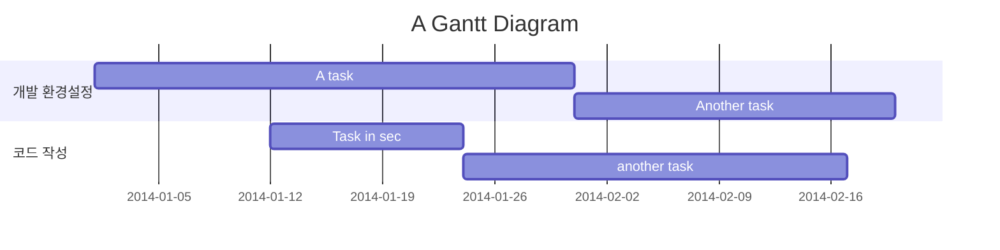

```mermaid
gantt
    title A Gantt Diagram
    dateFormat  YYYY-MM-DD
    section 개발 환경설정
    A task           :a1, 2014-01-01, 30d
    Another task     :after a1  , 20d
    section 코드 작성
    Task in sec      :2014-01-12  , 12d
    another task      : 24d
```
