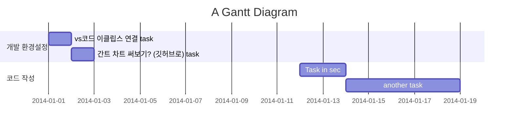

```mermaid
gantt
    title A Gantt Diagram
    dateFormat  YYYY-MM-DD
    section 개발 환경설정
    vs코드 이클립스 연결 task           :a1, 2014-01-01, 1d
    간트 차트 써보기? (깃허브로) task     :after a1  , 1d
    section 코드 작성
    Task in sec      :2014-01-12  , 2d
    another task      : 5d
```
