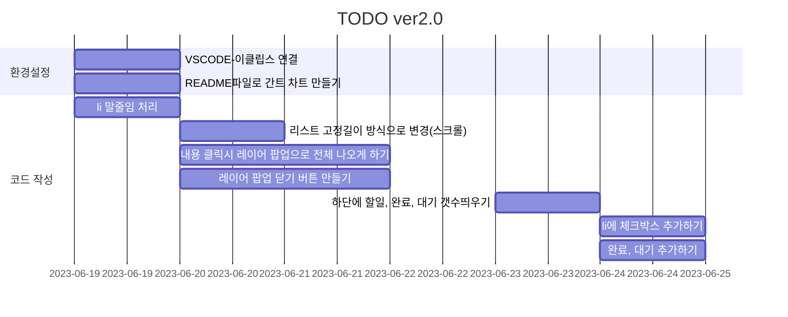

# 📖TODO ver2.0 :fire:

변경점

- VSCODE-이클립스 연결-완료
- README파일로 간트 차트 만들기 
- li 말줄임 처리
- 리스트 고정길이 방식으로 변경(스크롤)
- 내용 클릭시 레이어 팝업으로 전체 나오게 하기
- 레이어 팝업 안쪽에 수정,삭제 버튼 만들기// 수정버튼 보류
- html 세션 저장소 이용해서 새로고침 시 유지하게 하기// 포기
- 왼쪽 하단에 할일 갯수띄우기
- 체크박스 추가하여 완료, 대기 갯수도 추가하기 

특이사항

- over-flow가 잘 먹히지 않는다면 word-break 속성을 확인
- 레이어 팝업에서 모달로 변경, 무슨 차이인지는 아직도 잘 모름
- 모달 생성시 길이가 변하지 않는곳에서 생성을 해야 함
- 모달 안에 버튼을 생성하면 이쁘지 않아서 바깥으로 변경하여 진행함
- 수정기능을 만드려면 모달 생성 시 추가 버튼을 수정 버튼으로 바꾸고 수정 버튼 클릭시 li와 모달의 값을 변경하는 메소드를 만들면 가능할듯
- 위에서 문제가 되는게 수정 내용 입력 후 수정 버튼을 눌렀을 때, 그 li를 찾아가는게 문제가 된다...

