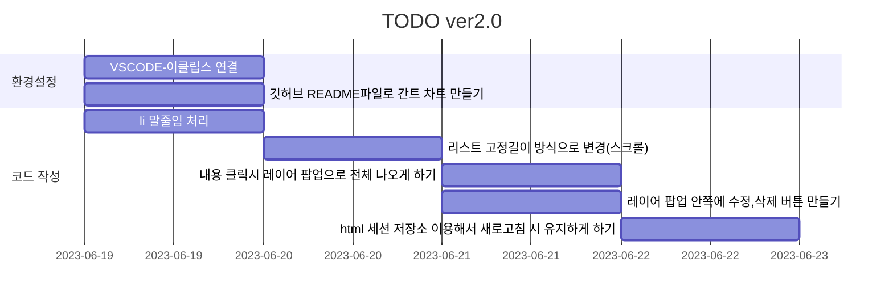

# 📖TODO ver2.0 :fire:

변경점

- VSCODE-이클립스 연결-완료
- 깃허브 README파일로 간트 차트 만들기 
- li 말줄임 처리
- 리스트 고정길이 방식으로 변경(스크롤)
- 내용 클릭시 레이어 팝업으로 전체 나오게 하기
- 레이어 팝업 안쪽에 수정,삭제 버튼 만들기
- html 세션 저장소 이용해서 새로고침 시 유지하게 하기

